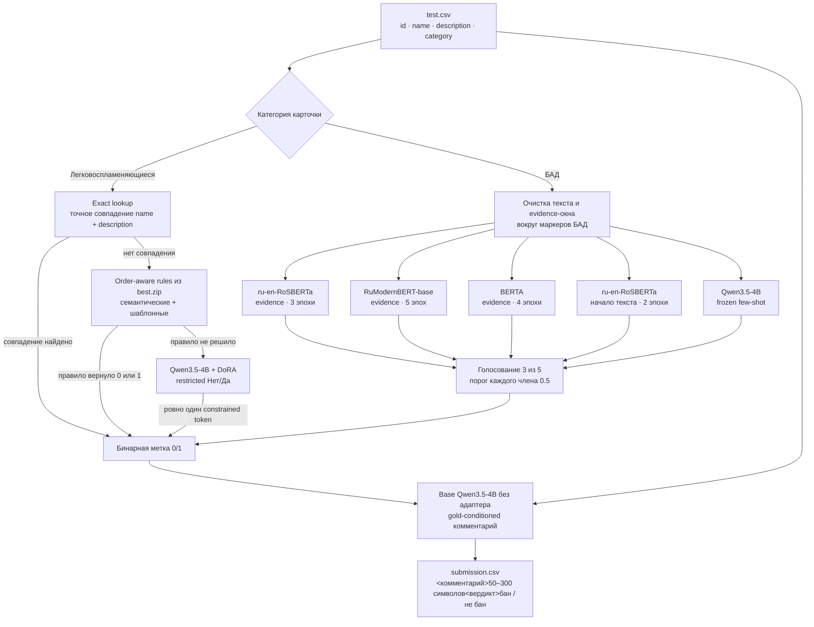
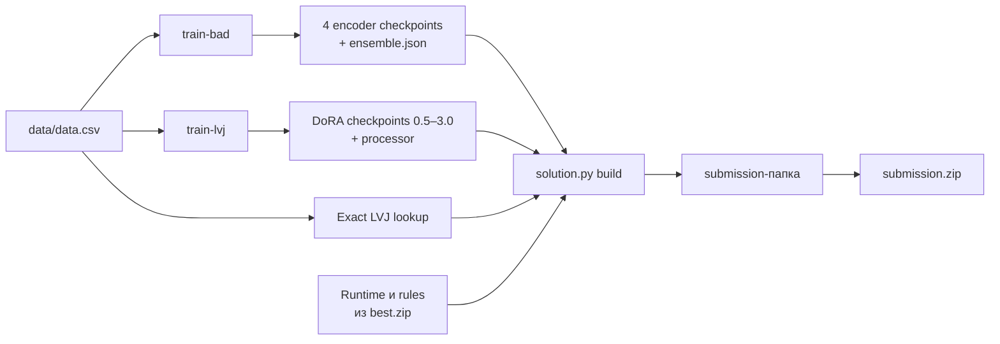

# E-CUP 2026 — контроль качества карточек

Воспроизводимый код полного решения задачи классификации карточек: **БАД + ЛВЖ**.
Одна точка входа — `solution.py`. Она обучает обе ветки и собирает готовую
submission-папку (при необходимости сразу ZIP).

## Как устроено решение



### Ветка БАД

Сначала из названия и описания строится `evidence`-текст: начало карточки плюс
окна вокруг прямых маркеров БАД. Затем независимо работают четыре дообученных
энкодера и frozen Qwen3.5-4B с четырьмя few-shot примерами. Каждый член голосует
по собственному порогу `0.5`; итоговая метка равна `1`, если набралось минимум
три положительных голоса. Конфигурация зафиксирована в
[`bad/specs/spec_es5_vote3.json`](bad/specs/spec_es5_vote3.json).

Для OOF из БАД-части сначала удаляются точные дубликаты
`(name, description)`, затем используется `StratifiedGroupKFold`: одинаковые
описания не могут попасть одновременно в train и validation. Итоговые четыре
энкодера после выбора эпох переобучаются на всех очищенных данных; Qwen остаётся
необучаемым пятым членом.

### Ветка ЛВЖ

Это каскад, а не один классификатор:

1. **Exact lookup** возвращает train-метку только при посимвольном совпадении
   пары `name + description`; конфликтующие ключи запрещены сборщиком.
2. **Order-aware rules** из исходного `best.zip` проверяют физические признаки
   товара и известные шаблоны карточек. В production они могут вернуть `0`, `1`
   либо `None`.
3. Только `None` уходит в **Qwen3.5-4B с DoRA**. Инференс ограничен одним первым
   токеном из множества `{Нет, Да}`, поэтому свободной генерации метки нет.

DoRA обучается на всех 3951 LVJ-карточках: rank 16, 128 target-модулей,
restricted two-token CE по `Нет/Да`, вес положительного класса `×6`, без
few-shot и retrieval. Сохраняются checkpoints `0.5, 1.0, …, 3.0`; при сборке
выбирается нужная эпоха, по умолчанию `2.0`.

### Комментарий и финальный формат

После получения меток для обеих категорий загружается **чистый base Qwen без
LoRA/DoRA**. Он получает карточку и уже зафиксированную правильную метку и пишет
короткое конкретное основание. Комментарий не участвует в классификации и не
может изменить вердикт. Постпроцесс гарантирует одну строку длиной 50–300
символов и формат:

```text
<комментарий>...<вердикт>бан
<комментарий>...<вердикт>не бан
```

Соответствие меток: `label=1 → не бан`, `label=0 → бан`.

## Что воспроизводит `solution.py`



Команда `all` последовательно запускает обе тренировки и сборку. `build`
переносит production runtime из `best.zip`, добавляет BAD-артефакты, выбранный
DoRA checkpoint, processor, exact lookup и vendored PEFT, затем фиксирует SHA256
в runtime-контракте. Поэтому собранный сабмит падает при незаметной подмене
адаптера, lookup или файла регулярных правил.

## Структура

- `bad/` — обучение, grouped OOF, подбор ансамбля и production-инференс БАД;
- `lvj/train_dora.py` — исходная Kaggle-ячейка full-train DoRA до 3 эпох;
- `submission/template/` — exact production runtime и order-aware регулярки,
  перенесённые из `best.zip` без переписывания;
- `bad/specs/spec_es5_vote3.json` — итоговый контракт ансамбля 3 из 5;
- `bad/RESULTS.md` — таблица экспериментов и метрик;
- `data/data.csv` — зафиксированный обучающий датасет соревнования;
- `requirements-kaggle-frozen.txt` — точный снимок использованного Kaggle
  runtime (931 пакет, SHA256 `dc41c817...59ee9`), только для аудита среды;
- `pyproject.toml` и `requirements-critical.txt` — переносимые зависимости
  решения.

## Быстрый старт

```bash
uv venv .venv --python 3.12
uv pip install --python .venv/bin/python -e .
.venv/bin/python solution.py --help
```

## Полное воспроизведение

```bash
# Один end-to-end запуск:
.venv/bin/python solution.py all \
  --workdir ./ecup_reproduction \
  --epoch 2 \
  --zip

# При временном сбое BAD-stage автоматически повторяется один раз: полностью
# сохранённые энкодеры переиспользуются, незавершённый member обучается заново.
# Завершённый LVJ-stage также переиспользуется; неполный LVJ-каталог сохраняется
# рядом с суффиксом `.incomplete-N`, после чего stage запускается чисто.

# Те же стадии по отдельности, если обучение разнесено по сессиям:
# 1. Обучить четыре BAD-энкодера; Qwen остаётся frozen runtime member.
.venv/bin/python solution.py train-bad \
  --out ./bad_artifacts

# 2. Обучить LVJ DoRA. При отсутствии локального Qwen он скачивается с HF.
.venv/bin/python solution.py train-lvj \
  --out ./lvj_training

# 3. Собрать runtime: exact lookup -> rules from best.zip -> DoRA fallback.
.venv/bin/python solution.py build \
  --bad-artifacts ./bad_artifacts \
  --lvj-training ./lvj_training \
  --epoch 2 \
  --out ./ecup_submission \
  --zip
```

Готовый runtime запускается так:

```bash
.venv/bin/python run.py -i /path/to/test.csv -o /path/to/submission.csv
```

`data/data.csv` используется автоматически. Если backbone отсутствует локально и
в Hugging Face cache, он скачивается через интернет. Другой train или локальную
Qwen-модель при необходимости можно передать через `--data` и `--model`.

Детали BAD-ветки описаны в [`bad/README.md`](bad/README.md). Веса моделей,
`runs/` и собранные submission-артефакты в Git не включаются.

> Перед публичной публикацией нужно добавить выбранную владельцем репозитория
> лицензию. Лицензии сторонних backbone-моделей регулируются их model cards.
